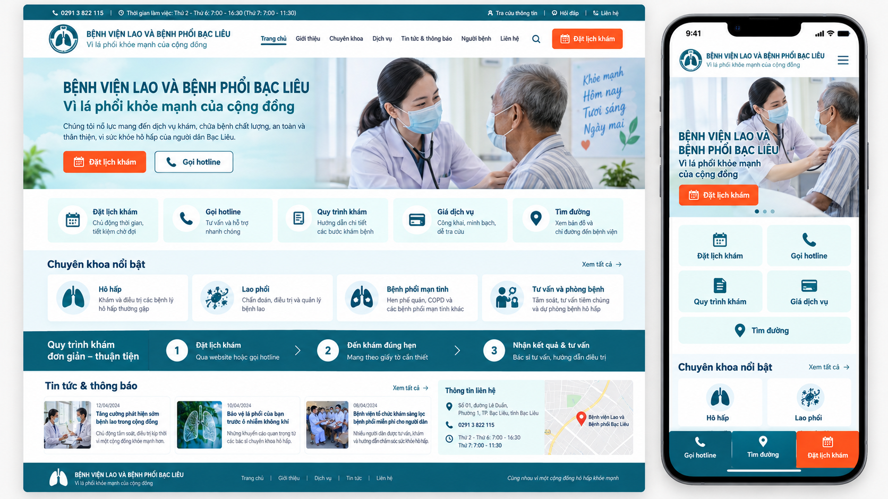

# BÁO CÁO KẾ HOẠCH XÂY DỰNG WEBSITE

## Bệnh viện Lao và Bệnh phổi Bạc Liêu

**Ngày lập:** 25/09/2026  
**Website khảo sát:** [https://bvlbpbl.vn/](https://bvlbpbl.vn/)  
**Phạm vi:** Đánh giá website hiện tại, đề xuất giao diện, chức năng, kiến trúc kỹ thuật, lộ trình và tiêu chí nghiệm thu.

---

## 1. Tóm tắt đề xuất

Website mới nên được xây dựng theo định hướng **mobile-first, lấy người bệnh làm trung tâm**, thay cho cách tổ chức nội dung thiên về cơ cấu nội bộ hiện nay.

Các tác vụ cần được đặt ở vị trí nổi bật:

- Đặt lịch khám.
- Gọi hotline.
- Xem quy trình khám BHYT và khám dịch vụ.
- Tra cứu giá dịch vụ.
- Xem lịch khám/lịch làm việc.
- Chỉ đường đến bệnh viện.
- Tìm hiểu chuyên khoa và kiến thức phòng bệnh.

Thời gian triển khai phiên bản đầu tiên dự kiến **09 tuần**. Tích hợp HIS, thanh toán, kết quả xét nghiệm hoặc cổng người bệnh nên triển khai ở giai đoạn sau, khi đã có API và phương án bảo vệ dữ liệu được phê duyệt.

---

## 2. Giao diện đồ họa minh họa



Ảnh trên là **concept minh họa trước khi triển khai**, gồm giao diện desktop và mobile. Đây chưa phải thiết kế cuối cùng. Logo, hình ảnh, nội dung, số điện thoại, địa chỉ và thông tin nghiệp vụ phải được bệnh viện xác nhận trước khi sử dụng chính thức.

### Định hướng thể hiện

- Màu xanh y tế và xanh ngọc tạo cảm giác tin cậy, sạch sẽ, thân thiện.
- Màu cam chỉ dùng cho hành động quan trọng như “Đặt lịch khám”.
- Header gọn, hiển thị rõ tên bệnh viện, hotline, tìm kiếm và CTA.
- Hero dùng ảnh thật về hoạt động khám chữa bệnh của bệnh viện.
- Tiện ích quan trọng được trình bày bằng thẻ lớn, dễ chạm trên điện thoại.
- Mobile có thanh thao tác cố định: gọi điện, chỉ đường, đặt lịch.
- Tin tức, thông báo và hướng dẫn người bệnh được phân nhóm rõ ràng.
- Không dùng sidebar dài hoặc carousel tự động gây khó đọc.

---

## 3. Đánh giá website hiện tại

Khảo sát trực tiếp trang chủ và trang đặt lịch ngày 25/09/2026 ghi nhận:

| Hạng mục | Hiện trạng | Ưu tiên |
|---|---|---|
| Responsive | Màn hình 390 px nhưng nội dung vẫn rộng khoảng 1.000 px, gây cuộn ngang | Rất cao |
| Hiệu năng | Khoảng 67 tài nguyên, tổng dung lượng khoảng 8,5 MB; một ảnh gần 5,9 MB | Cao |
| Công nghệ | Joomla và thư viện giao diện cũ; có mixed content và lỗi JavaScript | Cao |
| Điều hướng | Thiên về phòng/khoa nội bộ; tác vụ người bệnh chưa được ưu tiên | Cao |
| SEO | Trang chủ không có H1 rõ ràng; metadata còn đơn giản | Cao |
| Accessibility | 22/29 ảnh thiếu alt; nhiều liên kết rỗng và ô nhập thiếu nhãn | Cao |
| Đặt lịch | Thu họ tên, địa chỉ, điện thoại, mã BHYT nhưng chưa thấy bước đồng ý/chính sách dữ liệu rõ ràng | Rất cao |
| Nội dung | Có bài trùng, lịch trực cũ và liên kết mạng xã hội cần kiểm tra | Trung bình |
| Riêng tư | Website đang hiển thị IP người truy cập | Cao |

### Nội dung cần kế thừa

- Giá dịch vụ và quy trình khám chữa bệnh.
- Văn bản, tài liệu, thông báo và mời báo giá.
- Tin bệnh viện, tin chuyên ngành và thông tin thuốc.
- Khoa/phòng và chương trình mục tiêu quốc gia.
- Biểu mẫu đăng ký khám.

Các nội dung trên cần được kiểm kê, làm sạch và chuyển sang cấu trúc mới có kiểm soát.

---

## 4. Mục tiêu sản phẩm

1. Người bệnh tìm thấy thông tin chính trong tối đa 2–3 thao tác.
2. Đặt lịch, gọi điện, xem giá và chỉ đường luôn dễ tiếp cận.
3. Hoạt động tốt từ điện thoại 320 px đến màn hình desktop lớn.
4. Nội dung có ngày cập nhật và đơn vị chịu trách nhiệm rõ ràng.
5. Nhân viên bệnh viện quản trị được mà không cần biết lập trình.
6. Hỗ trợ khả năng tiếp cận theo định hướng WCAG 2.2 mức AA.
7. Có kiến trúc mở để tích hợp HIS và dịch vụ số ở giai đoạn sau.
8. Giảm tối đa dữ liệu cá nhân không cần thiết trong biểu mẫu.

---

## 5. Đối tượng sử dụng

### Người bệnh và người nhà

Tìm thông tin khám, BHYT, giá dịch vụ, đường đi; đặt lịch; liên hệ bệnh viện; tìm hiểu bệnh lao, bệnh phổi và biện pháp phòng bệnh.

### Cơ quan, doanh nghiệp và nhà cung cấp

Theo dõi thông báo, văn bản, mời báo giá và đấu thầu.

### Cán bộ bệnh viện

Soạn/duyệt bài, cập nhật lịch và bảng giá; tiếp nhận, xử lý đăng ký khám.

### Ban quản trị

Quản lý tài khoản, phân quyền, nhật ký hệ thống, sao lưu và hoạt động website.

---

## 6. Cấu trúc thông tin đề xuất

```text
Trang chủ
├── Dành cho người bệnh
│   ├── Đặt lịch khám
│   ├── Lịch khám / lịch làm việc
│   ├── Quy trình khám BHYT
│   ├── Quy trình khám dịch vụ
│   ├── Giá dịch vụ
│   ├── Hướng dẫn nhập viện
│   └── Câu hỏi thường gặp
├── Chuyên khoa – dịch vụ
│   ├── Khám bệnh
│   ├── Lao
│   ├── Bệnh phổi
│   ├── Hồi sức cấp cứu
│   ├── Xét nghiệm
│   └── Chẩn đoán hình ảnh – thăm dò chức năng
├── Chương trình sức khỏe
│   ├── Phòng, chống lao
│   └── COPD và hen phế quản
├── Tin tức – thông báo
│   ├── Hoạt động bệnh viện
│   ├── Kiến thức sức khỏe
│   ├── Thông báo
│   └── Mời báo giá / đấu thầu
├── Tra cứu văn bản
├── Giới thiệu
│   ├── Tổng quan
│   ├── Ban giám đốc
│   ├── Sơ đồ tổ chức
│   └── Khoa/phòng
└── Liên hệ – chỉ đường
```

Các nội dung cơ cấu tổ chức vẫn được bảo tồn nhưng chuyển về nhóm **Giới thiệu**, không chiếm diện tích lớn trên trang chủ.

---

## 7. Bố cục trang chủ

1. **Thanh thông báo:** thay đổi giờ khám, cảnh báo dịch bệnh hoặc thông báo quan trọng.
2. **Header:** logo, tên chính thức, hotline, tìm kiếm và nút đặt lịch.
3. **Hero:** một thông điệp chính, ảnh thật và hai CTA.
4. **Truy cập nhanh:** đặt lịch, hotline, quy trình khám, giá dịch vụ, chỉ đường.
5. **Chuyên khoa nổi bật:** giới thiệu ngắn và liên kết trang chi tiết.
6. **Quy trình khám:** trình bày thành ba bước dễ hiểu.
7. **Chương trình sức khỏe:** chống lao, COPD và hen phế quản.
8. **Tin tức và kiến thức sức khỏe:** ưu tiên nội dung mới, có ảnh và ngày đăng.
9. **Thông báo/mời báo giá:** tách khỏi tin sức khỏe để dễ tra cứu.
10. **Liên hệ:** bản đồ, hotline, giờ làm việc và hướng dẫn đường đi.
11. **Footer:** pháp lý, đơn vị chịu trách nhiệm, chính sách dữ liệu và liên kết cơ quan quản lý.

---

## 8. Chức năng phiên bản đầu tiên

### Quản trị nội dung

- Quản lý trang, bài viết, khoa/phòng, chuyên khoa và chương trình sức khỏe.
- Quản lý văn bản, bảng giá, lịch khám và tệp đính kèm.
- Phân quyền người soạn, người duyệt và quản trị viên.
- Lưu phiên bản, hẹn giờ xuất bản và nhật ký chỉnh sửa.

### Đặt lịch khám

- Chọn chuyên khoa, ngày và khung giờ.
- Nhập thông tin liên hệ tối thiểu cần thiết.
- Kiểm tra số điện thoại và dữ liệu bắt buộc.
- Hiển thị chính sách dữ liệu và yêu cầu đồng ý.
- Chống spam và đăng ký trùng.
- Gửi thông báo tiếp nhận qua SMS/email nếu có nhà cung cấp.
- Quản trị danh sách, trạng thái xử lý và xuất Excel.
- Chuẩn bị API để tích hợp HIS sau này.

### Tra cứu, SEO và chia sẻ

- Tìm kiếm tiếng Việt có dấu/không dấu.
- Lọc văn bản theo loại, năm, ngày ban hành và từ khóa.
- URL rõ ràng, sitemap, canonical và metadata từng trang.
- Dữ liệu có cấu trúc cho bệnh viện, bài viết và breadcrumb.
- Ảnh chia sẻ Facebook/Zalo.
- Chuyển hướng 301 từ URL cũ sang URL mới.

### An toàn hệ thống

- HTTPS toàn bộ website.
- Xác thực hai lớp cho quản trị viên.
- Phân quyền tối thiểu, nhật ký và khóa đăng nhập bất thường.
- Sao lưu tự động và kiểm thử khôi phục.
- WAF, giới hạn gửi biểu mẫu và kiểm soát tệp tải lên.
- Không công khai IP hoặc dữ liệu cá nhân của người truy cập.

---

## 9. Kiến trúc kỹ thuật đề xuất

### Phương án ưu tiên

- Frontend SSR/SSG bằng Next.js hoặc Nuxt.
- CMS độc lập: Directus, Strapi hoặc headless WordPress.
- API đặt lịch tách biệt, sẵn sàng kết nối HIS.
- Cơ sở dữ liệu PostgreSQL hoặc MySQL.
- CDN, WAF, giám sát uptime và sao lưu ngoài máy chủ chính.
- Ba môi trường: phát triển, thử nghiệm và vận hành.

### Phương án đơn giản hóa vận hành

Nếu bệnh viện không có đội CNTT thường xuyên, có thể dùng WordPress với giao diện riêng, plugin tối thiểu, cập nhật có kiểm soát và cấu hình bảo mật chặt.

Quyết định cuối cùng cần dựa trên hạ tầng, đội vận hành, yêu cầu lưu trữ, khả năng tích hợp HIS và ngân sách bảo trì.

---

## 10. Kế hoạch chuyển đổi nội dung

1. Quét toàn bộ URL và lập danh mục nội dung hiện có.
2. Phân loại: giữ, cập nhật, hợp nhất, lưu trữ hoặc loại bỏ.
3. Rà soát tên đơn vị, địa chỉ, số điện thoại và người chịu trách nhiệm.
4. Chuẩn hóa tiêu đề, ngày đăng, tác giả, danh mục và ảnh đại diện.
5. Nén ảnh và chuyển sang WebP/AVIF phù hợp.
6. Kiểm tra PDF, tệp tải xuống và liên kết ngoài.
7. Lập bảng ánh xạ URL cũ sang URL mới.
8. Chuyển dữ liệu thử nghiệm và kiểm tra ngẫu nhiên.
9. Khóa nội dung cũ trong thời gian chuyển đổi cuối.
10. Kiểm tra redirect và liên kết hỏng trước khi phát hành.

---

## 11. Tiến độ dự kiến

| Thời gian | Công việc | Sản phẩm bàn giao |
|---|---|---|
| Tuần 1 | Khảo sát, phỏng vấn, kiểm kê nội dung | Báo cáo hiện trạng và yêu cầu |
| Tuần 2 | Sitemap, hành trình người dùng, wireframe | Cấu trúc và prototype thô |
| Tuần 3–4 | Thiết kế UI desktop/mobile | Bộ giao diện được duyệt |
| Tuần 4–7 | Lập trình frontend, CMS và đặt lịch | Website thử nghiệm |
| Tuần 6–8 | Làm sạch và chuyển nội dung | Dữ liệu trên hệ thống mới |
| Tuần 8 | QA, bảo mật, hiệu năng, accessibility, UAT | Báo cáo kiểm thử |
| Tuần 9 | Đào tạo, chuyển tên miền và phát hành | Website chính thức, tài liệu vận hành |

Tích hợp HIS hoặc SMS ngay từ đầu có thể cần thêm 2–4 tuần tùy API và nhà cung cấp.

---

## 12. Tiêu chí nghiệm thu

- Không tràn ngang từ màn hình 320 px trở lên.
- Hoạt động trên các trình duyệt phổ biến gần nhất.
- Không có mixed content hoặc lỗi JavaScript nghiêm trọng.
- LCP ≤ 2,5 giây; INP ≤ 200 ms; CLS ≤ 0,1.
- Trang chủ mục tiêu không vượt quá 2 MB ở lần tải đầu.
- Hoàn thành đặt lịch trên điện thoại trong tối đa ba phút.
- Có thông báo tiếp nhận và trạng thái xử lý rõ ràng.
- Điều hướng được bằng bàn phím; ảnh có alt; màu đủ tương phản.
- URL cũ quan trọng được chuyển hướng 301.
- Kiểm thử khôi phục bản sao lưu thành công.
- Không để lộ dữ liệu cá nhân trong log, URL hoặc giao diện công khai.
- 100% thông tin pháp lý và liên hệ được bệnh viện xác nhận.

---

## 13. Phân kỳ triển khai

### Giai đoạn 1 — Website thông tin và đặt lịch

Website responsive, CMS, quy trình duyệt bài, đặt lịch, văn bản, bảng giá, thông báo, mời báo giá, SEO, bảo mật và sao lưu.

### Giai đoạn 2 — Tích hợp dịch vụ số

Đồng bộ lịch từ HIS, xác nhận/đổi lịch tự động, Zalo OA/SMS, lấy số trực tuyến và thanh toán nếu đủ điều kiện.

### Giai đoạn 3 — Cổng người bệnh

Tra cứu lịch sử khám và kết quả bằng xác thực mạnh; quản lý lịch hẹn; tái khám, nhắc thuốc và chương trình bệnh mạn tính.

Giai đoạn 2 và 3 chỉ triển khai sau khi đánh giá an toàn thông tin, quyền truy cập và trách nhiệm xử lý dữ liệu.

---

## 14. Thông tin cần bệnh viện xác nhận

- Tên chính thức của đơn vị sau các thay đổi hành chính.
- Địa chỉ, hotline, giờ làm việc và người chịu trách nhiệm nội dung.
- Logo gốc, quy chuẩn thương hiệu và bộ ảnh chất lượng cao.
- Danh sách chuyên khoa, dịch vụ, bác sĩ và lịch khám.
- Người biên tập và người phê duyệt của từng phòng ban.
- Chính sách lưu giữ/xóa dữ liệu đặt lịch.
- Nhu cầu tích hợp HIS, SMS, email hoặc Zalo OA.
- Quyền truy cập hosting, tên miền, mã nguồn và cơ sở dữ liệu cũ.

---

## 15. Bước tiếp theo

1. Duyệt định hướng và phạm vi MVP.
2. Xác nhận thông tin pháp lý, bộ nhận diện và đầu mối nội dung.
3. Thiết kế sitemap chi tiết và wireframe các trang trọng tâm.
4. Thiết kế UI hoàn chỉnh desktop/mobile trên Figma.
5. Duyệt prototype trước khi bắt đầu lập trình.

---

## 16. Tài liệu tham khảo

- Website hiện tại: [https://bvlbpbl.vn/](https://bvlbpbl.vn/)
- Trang đặt lịch: [https://bvlbpbl.vn/index.php/dat-lich-kham-benh.html](https://bvlbpbl.vn/index.php/dat-lich-kham-benh.html)
- WCAG 2.2: [https://www.w3.org/TR/WCAG22/](https://www.w3.org/TR/WCAG22/)
- Core Web Vitals: [https://web.dev/articles/vitals](https://web.dev/articles/vitals)

---

## 17. Phương án backend và database local-first đã chốt

**Cập nhật:** 26/09/2026

Mục tiêu là tận dụng máy chủ nội bộ để giảm chi phí nhưng không công khai trực tiếp IP hoặc cổng của bệnh viện.

### 17.1. Kiến trúc

```text
Người bệnh
├── Website tĩnh
└── API đặt lịch
    └── Cloudflare Tunnel
        └── Máy chủ nội bộ
            ├── Django + Waitress
            ├── PostgreSQL
            ├── Django Admin
            └── Tệp và bản sao lưu

Nhân viên
└── LAN/VPN/Cloudflare Access
    └── Django Admin
```

- Giữ frontend HTML/CSS/JavaScript hiện tại; không viết lại Next.js khi chưa cần.
- Backend dùng Django 5.2 và Django Admin để giảm số dịch vụ phải vận hành.
- PostgreSQL đặt trên cùng mạng nội bộ với backend; SQLite chỉ dùng cho phát triển và kiểm thử.
- API công khai chỉ tiếp nhận đặt lịch và đọc danh mục cần thiết; không có API công khai đọc danh sách bệnh nhân.
- Trang quản trị chỉ mở qua LAN, VPN hoặc lớp kiểm soát truy cập đã được duyệt.
- Cloudflare Tunnel dùng kết nối outbound; không mở port modem tới máy chủ.

### 17.2. Phạm vi dữ liệu giai đoạn đầu

- Chỉ thu họ tên, số điện thoại, ngày mong muốn, chuyên khoa và bằng chứng đồng ý.
- Chưa thu CCCD, mã BHYT, mô tả bệnh, kết quả xét nghiệm hoặc hồ sơ khám.
- Mỗi đăng ký có UUID nội bộ, mã tra cứu ngẫu nhiên, trạng thái và lịch sử thay đổi.
- Chống gửi lặp bằng idempotency key và ràng buộc số điện thoại/chuyên khoa/ngày.
- Không ghi dữ liệu cá nhân vào URL hoặc access log.

### 17.3. Chi phí

- Django, PostgreSQL, Waitress và Cloudflare Tunnel gói Free: không có phí bản quyền.
- Cloudflare Connect là sự kiện có bán vé, không phải dịch vụ cần mua để vận hành website.
- Vẫn có chi phí tên miền, điện, Internet, UPS, ổ sao lưu và SMS/Zalo nếu bật.
- Không kích hoạt Pro, Business, Argo, Load Balancing hoặc add-on trả phí trong MVP.

### 17.4. Lộ trình triển khai

| Giai đoạn | Công việc | Trạng thái |
|---|---|---|
| 1 | Django, mô hình database, migration, API đặt lịch, Admin, kiểm thử | Đang triển khai |
| 2 | PostgreSQL local, tài khoản và phân quyền nhân viên, xuất Excel | Đang triển khai: PostgreSQL và role database đã xong |
| 3 | CMS bài viết, văn bản, bảng giá, lịch khám | Chưa thực hiện |
| 4 | Sao lưu tự động, phục hồi thử, giám sát và đóng gói Windows service | Chưa thực hiện |
| 5 | Cloudflare Free, tên miền API, chống bot/rate limit và kiểm thử UAT | Chưa thực hiện |
| 6 | HIS, SMS/Zalo và OTP nếu được phê duyệt | Giai đoạn sau |

### 17.5. Sao lưu và an toàn vận hành

- Sao lưu PostgreSQL hằng ngày sang ổ đĩa thứ hai hoặc NAS.
- Sao lưu mã hóa hằng tuần sang thiết bị rời; không chỉ giữ bản sao trên cùng máy.
- Giữ dự kiến 14 bản ngày, 8 bản tuần và 12 bản tháng.
- Kiểm thử phục hồi tối thiểu hằng tháng.
- Máy chủ, modem và thiết bị mạng quan trọng dùng UPS.
- Khóa bí mật, mật khẩu database và tệp `.env` không đưa vào Git.
- Chỉ cấu hình endpoint production sau khi xác minh quyền quản lý tên miền và chính sách xử lý dữ liệu.

### 17.6. Điều kiện trước khi phát hành

1. Cài PostgreSQL và driver `psycopg` trên máy chủ nội bộ.
2. Tạo tài khoản database riêng, không dùng tài khoản quản trị PostgreSQL để chạy ứng dụng.
3. Tạo tài khoản Django Admin và phân quyền theo nhiệm vụ.
4. Duyệt chính sách đồng ý, thời gian lưu và quy trình xóa dữ liệu đặt lịch.
5. Cấu hình HTTPS, CORS đúng tên miền và Cloudflare Tunnel gói Free.
6. Bổ sung rate limit/Turnstile, sao lưu, nhật ký và thử phục hồi.
7. Kiểm thử UAT bằng dữ liệu giả; không dùng hồ sơ bệnh nhân thật trước nghiệm thu.
